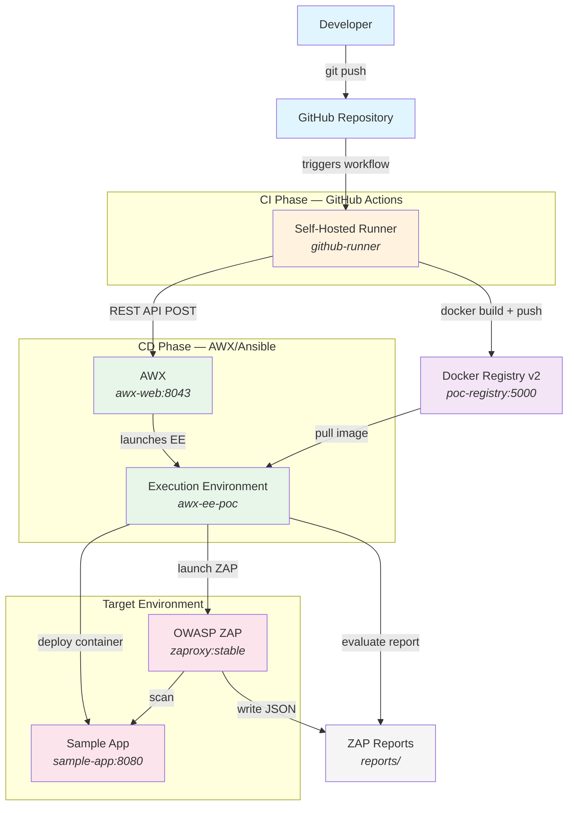
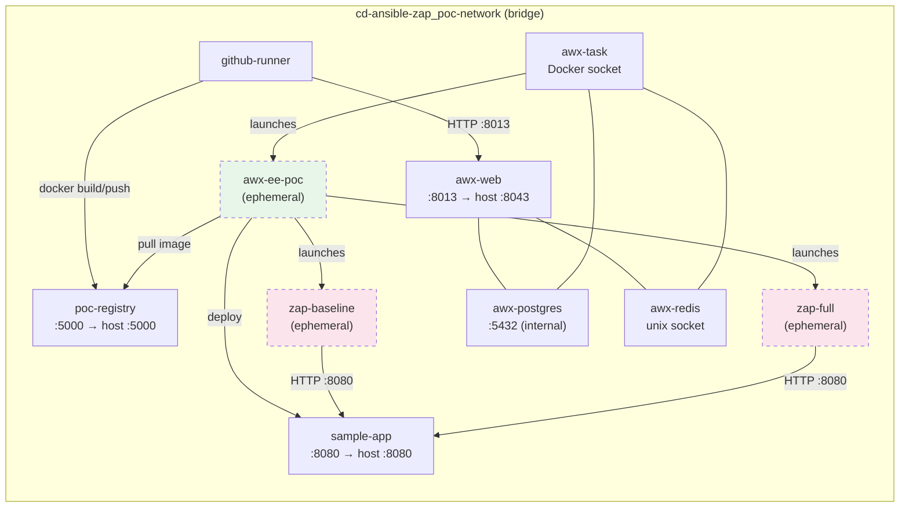
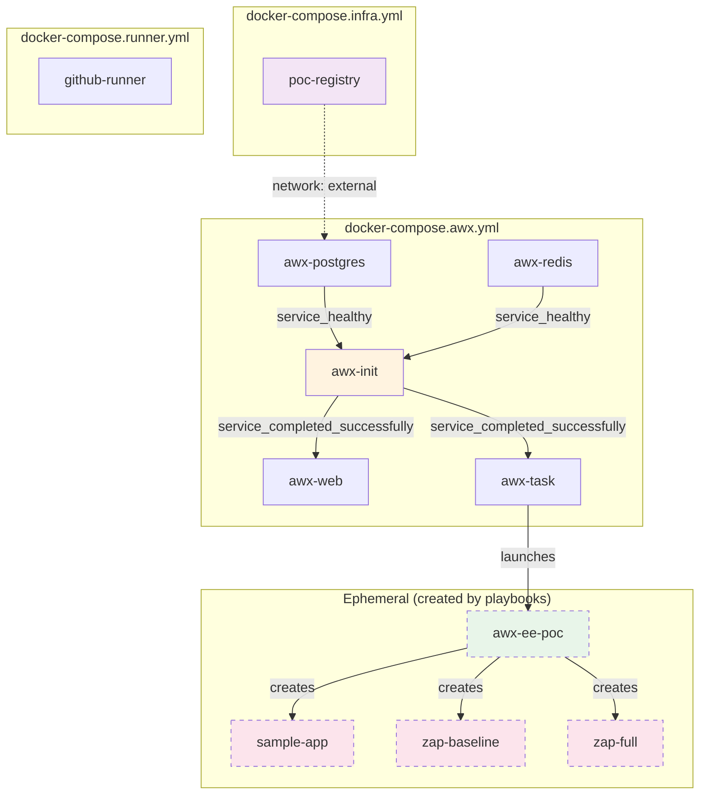

# Architecture Overview

## Introduction

This document describes the architecture of the CI/CD pipeline Proof of Concept (PoC) that demonstrates a decoupled pipeline using GitHub Actions for CI and AWX/Ansible for CD, with integrated OWASP ZAP DAST scanning. The complete environment runs on a single local workstation using containerized components.

For business objectives, scope, and requirements, see the [Business Requirements Document](../brd-poc-cd-ansible.md).

## High-Level System Architecture

The pipeline consists of two phases: a CI phase (GitHub Actions) that builds and pushes container images, and a CD phase (AWX/Ansible) that deploys the application and runs security scans.

## Docker Network Topology

All containers communicate over a single shared Docker bridge network (`cd-ansible-zap_poc-network`), created by the infrastructure compose file. Compose files that join this network reference it as `external: true`.

> **Note:** Dashed borders indicate ephemeral containers that are created and destroyed during pipeline execution. The EE container runs each Ansible job, while ZAP containers run for each scan type.

### Key Networking Details

- The **self-hosted runner** connects to AWX via `awx-web:8013` (the container's internal nginx port), not `localhost:8043`, because both containers share the Docker network.
- **ZAP** targets the application as `http://sample-app:8080` using Docker DNS resolution.
- The **deploy playbook** uses an `app_host` variable (default: `localhost`) to configure the health check target. When run inside the EE, AWX overrides this to `sample-app` so the health check uses Docker DNS.

## Container Relationships and Startup Order

The PoC uses four Docker Compose files. Dependencies use `service_healthy` (healthcheck-based) or `service_completed_successfully` (init container) conditions.

### Startup Sequence

1. **Infrastructure** (`docker-compose.infra.yml`) — Start first. Creates the `cd-ansible-zap_poc-network` bridge network and launches the Docker registry.
2. **AWX** (`docker-compose.awx.yml`) — Start second. PostgreSQL and Redis must be healthy before `awx-init` runs migrations. Web and task containers start only after init completes successfully.
3. **Runner** (`docker-compose.runner.yml`) — Start third. Requires the network to already exist and a valid `RUNNER_TOKEN` in `.env`.
4. **Ephemeral containers** — Created dynamically by Ansible playbooks running inside the EE during pipeline execution.

## Port Mapping Reference

| Service | Container Name | Container Port | Host Port | Protocol |
|---|---|---|---|---|
| Docker Registry | `poc-registry` | 5000 | 5000 | HTTP |
| AWX Web UI/API | `awx-web` | 8013 (nginx) | 8043 | HTTP |
| Sample App | `sample-app` | 8080 | 8080 | HTTP |
| PostgreSQL | `awx-postgres` | 5432 | — | TCP (internal) |
| Redis | `awx-redis` | — | — | Unix socket |
| Receptor | `awx-task` | 2222 | — | TCP (internal) |

## Technology Stack

| Technology | Version | Role |
|---|---|---|
| GitHub Actions | — | CI orchestration (workflow runner) |
| AWX | 24.6.1 | CD orchestration (job templates, workflows, API) |
| Ansible | ansible-core 2.16+ | Automation language (playbooks) |
| Docker / Docker Compose | Latest stable | Container runtime and orchestration |
| Docker Registry v2 | 2.x | Local container image storage |
| OWASP ZAP | stable (latest) | DAST security scanning |
| Spring Boot | 3.4.1 | Sample application framework |
| Java | 17 | Sample application runtime |
| Maven | 3.9 | Sample application build tool |
| PostgreSQL | 15 | AWX database |
| Redis | 7 | AWX message broker (Unix socket) |
| Receptor | 1.6.3 | AWX job mesh transport |
| nginx | bundled with AWX | AWX reverse proxy |

---

*See also: [Pipeline Workflow](pipeline-workflow.md) | [Technical Design](technical-design.md) | [Component Reference](component-reference.md)*
