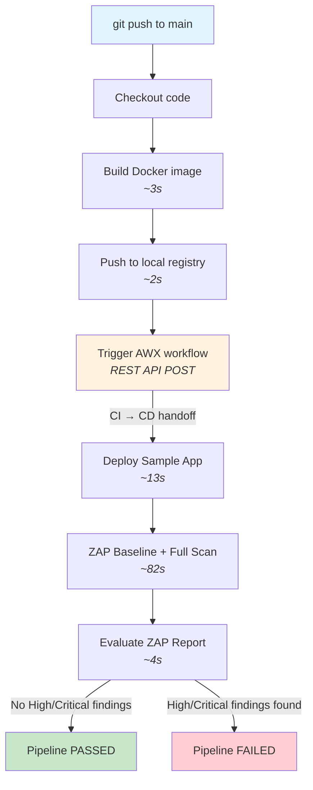
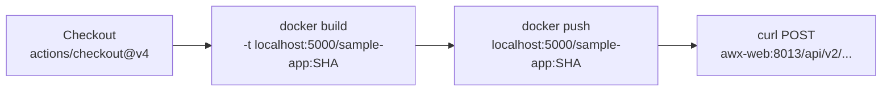
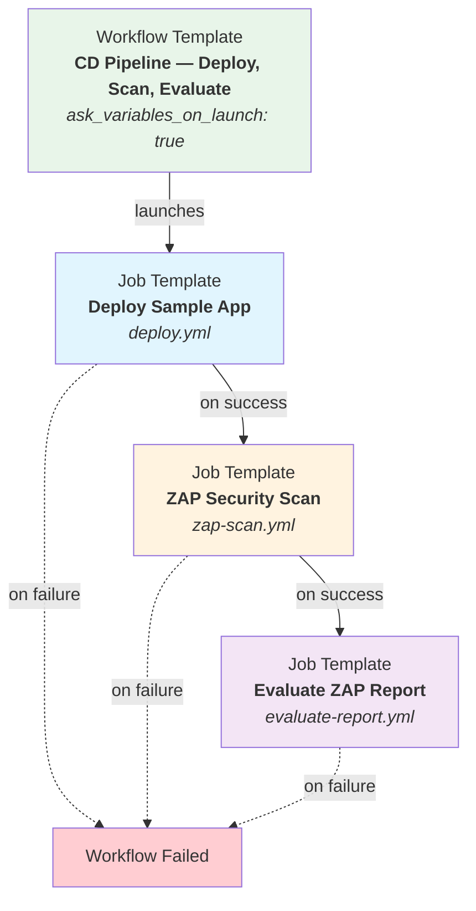
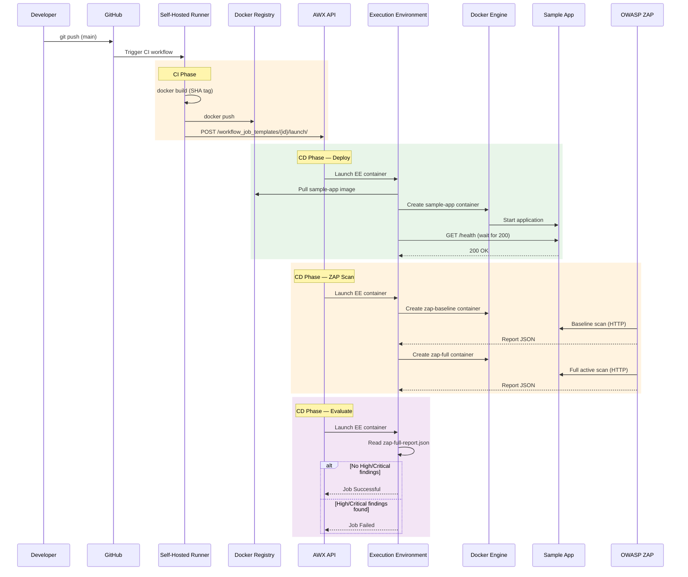
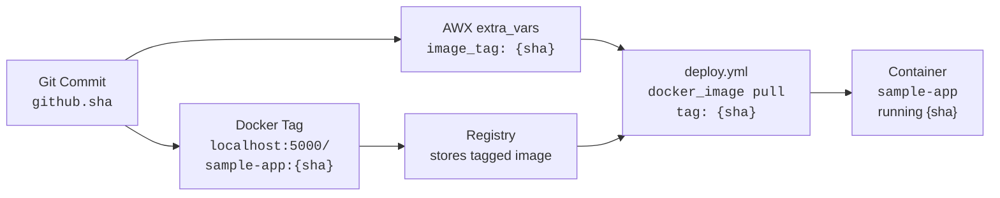
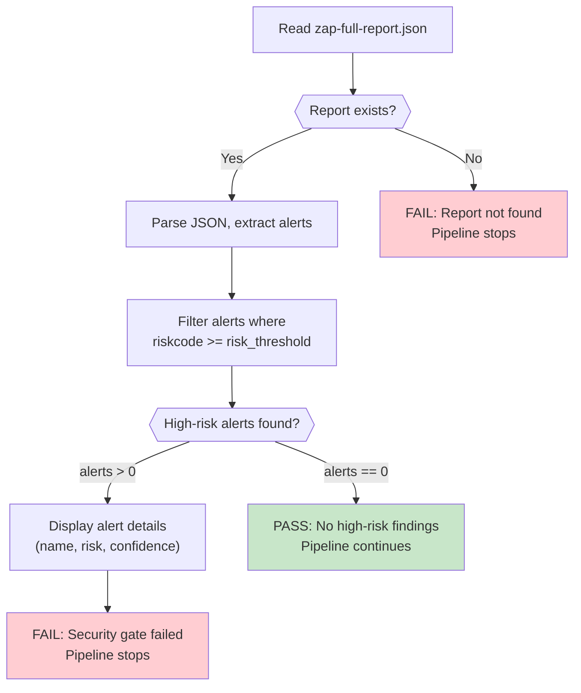

# Pipeline Workflow

## Pipeline Overview

The CI/CD pipeline executes in two phases triggered by a `git push` to the `main` branch:

| Phase | Orchestrator | Duration | Steps |
|---|---|---|---|
| **CI** | GitHub Actions (self-hosted runner) | ~12s | Checkout, build image, push to registry, trigger AWX |
| **CD** | AWX Workflow Template | ~99s | Deploy (~13s), ZAP Scan (~82s), Evaluate (~4s) |

The CI phase builds and pushes the container image, then hands off to the CD phase via REST API. The CD phase deploys the application, runs security scans, and enforces the security gate.

## End-to-End Pipeline Flow



## CI Phase — GitHub Actions

The CI workflow is defined in `.github/workflows/ci.yml`. It runs on a self-hosted runner registered with the `local-poc` label.



### Why `awx-web:8013` instead of `localhost:8043`?

The self-hosted runner container and AWX web container both run on the shared Docker network (`cd-ansible-zap_poc-network`). Inside this network, containers communicate using container names and internal ports. AWX's nginx listens on port **8013** inside the container, which is mapped to host port **8043**. Since the runner is inside the Docker network, it uses the internal address `awx-web:8013`.

### Required GitHub Secrets

| Secret | Source | Description |
|---|---|---|
| `AWX_TOKEN` | `awx-setup.sh` output | OAuth2 bearer token for AWX API authentication |
| `AWX_WORKFLOW_TEMPLATE_ID` | `awx-setup.sh` output | ID of the Workflow Template to launch |

### Workflow Trigger

The workflow triggers on pushes to the `main` branch only:

```yaml
on:
  push:
    branches: [main]
```

## CD Phase — AWX Workflow

The CD phase is orchestrated by an AWX Workflow Template that chains three Job Templates. Each node advances only on the success of the previous node.



### Variable Flow Through the Workflow

The Workflow Template is configured with `ask_variables_on_launch: true`, which allows the CI phase to pass `extra_vars` at launch time. The `image_tag` variable flows through the workflow:

1. **CI** passes `{"extra_vars": {"image_tag": "<git-sha>"}}` when launching the workflow.
2. The **Workflow Template** propagates `extra_vars` to each child node.
3. The **Deploy Job Template** (`ask_variables_on_launch: true`) receives `image_tag` and uses it to pull the correct image.
4. The **ZAP Scan** and **Evaluate** Job Templates use pre-configured `extra_vars` (host-absolute paths) and do not require `image_tag`.

## Sequence Diagram



## Image Tag Data Flow

The Git commit SHA serves as the immutable image tag, propagating through every stage of the pipeline.



This ensures full traceability from Git commit to running container — every deployment can be traced back to the exact source code revision.

## Security Gate Logic

The `evaluate-report.yml` playbook reads the ZAP full scan report and enforces a configurable risk threshold.



### ZAP Risk Codes

| Risk Code | Level | Gate Behavior (threshold=3) |
|---|---|---|
| 0 | Informational | Pass |
| 1 | Low | Pass |
| 2 | Medium | Pass |
| 3 | High | **Fail** |
| 4 | Critical | **Fail** |

The `risk_threshold` variable defaults to `3` (High). Any alert with a `riskcode` greater than or equal to the threshold causes the pipeline to fail. This is configurable — setting it to `2` would also fail on Medium findings.

---

*See also: [Architecture Overview](architecture.md) | [Technical Design](technical-design.md) | [Component Reference](component-reference.md)*
