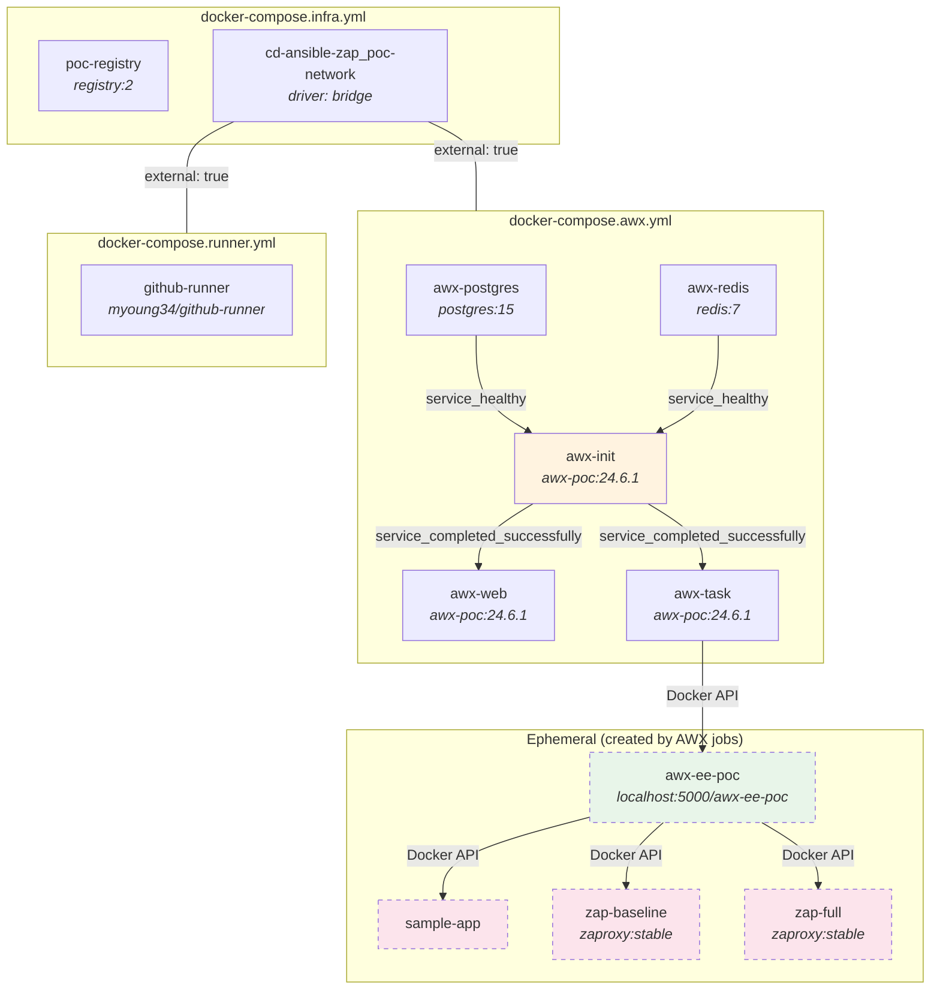
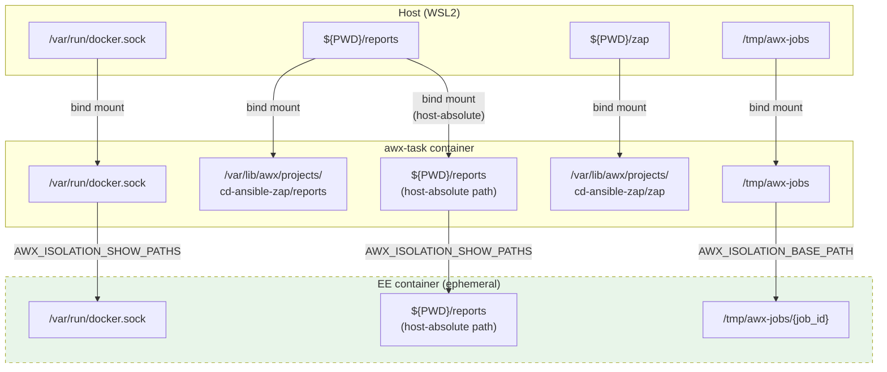

# Technical Design

This document explains the engineering decisions, workarounds, and implementation details behind the PoC infrastructure. It covers the problems encountered and how they were solved.

## Docker Compose Service Topology

The PoC uses four Docker Compose files. The infrastructure compose creates the shared network; all others reference it as external.



## AWX Custom Image (`awx/Dockerfile`)

The custom AWX image extends `quay.io/ansible/awx:24.6.1` with three additions:

| Layer | What | Why |
|---|---|---|
| Receptor 1.6.3 | Binary from GitHub releases | AWX requires a receptor mesh for job execution. The receptor daemon runs inside `awx-task` and needs a `tcp-listener` on port 2222 to stay alive (it exits without any configured backends). |
| Docker CLI 27.5.1 | Static binary from `download.docker.com` | AWX launches Execution Environment containers. It hardcodes `process_isolation_executable: podman`, so we symlink `/usr/bin/docker` to `/usr/bin/podman` to satisfy AWX while using Docker. |
| `/tmp/awx-jobs` | Shared directory | `ansible-runner` writes job data here. Both the `awx-task` container and the host mount this path, so EE containers can access job artifacts via Docker bind mounts. |

### Receptor Configuration

The receptor config (`awx/config/receptor.conf`) defines:
- **Node ID:** `awx`
- **TCP listener:** port 2222 (keeps the daemon alive)
- **Control service:** Unix socket at `/var/run/receptor/receptor.sock`
- **Work command:** full path `/var/lib/awx/venv/awx/bin/ansible-runner` (required — relative paths fail)

## Execution Environment (`awx/Dockerfile.ee`)

AWX 24.6.1 mandates Execution Environments (EE) for all job execution — there is no fallback to local/`builtins` mode. The custom EE image extends `quay.io/ansible/awx-ee:latest`:

```dockerfile
FROM quay.io/ansible/awx-ee:latest
USER root
RUN pip3 install --no-cache-dir --target=/usr/lib/python3.9/site-packages docker requests && \
    ansible-galaxy collection install community.docker
USER 1000
```

### Python Version Issue

The `awx-ee:latest` image ships with two Python interpreters:
- **Python 3.9** — used by Ansible (`ansible-playbook` shebang)
- **Python 3.11** — used by `pip3`

Running `pip3 install docker` installs to the Python 3.11 site-packages, but Ansible runs under Python 3.9 and cannot find the `docker` module. The fix: `--target=/usr/lib/python3.9/site-packages` forces pip to install directly into the Python 3.9 path.

### EE Image Distribution

The EE image is built locally and pushed to the local registry:

```bash
docker build -t localhost:5000/awx-ee-poc:latest -f awx/Dockerfile.ee awx/
docker push localhost:5000/awx-ee-poc:latest
```

AWX is configured (via `awx-setup.sh`) to use `localhost:5000/awx-ee-poc:latest` with `pull: missing`.

## Volume Mount Strategy

The most complex aspect of this PoC is the three-layer volume mount chain that allows the EE container (running as a sibling container on the host Docker engine) to access files from both AWX and the host.



### Four Critical Challenges Solved

#### 1. Docker Socket Passthrough

The EE container needs to manage Docker containers (deploy app, launch ZAP). Since AWX uses Docker-in-Docker (sibling containers), the host Docker socket must be passed through:

- **Host → awx-task:** `/var/run/docker.sock:/var/run/docker.sock` (in `docker-compose.awx.yml`)
- **awx-task → EE:** `AWX_ISOLATION_SHOW_PATHS: ["/var/run/docker.sock"]` (set via API)

#### 2. Path Identity Problem

Ansible playbooks use `{{ reports_dir | realpath }}` for Docker volume mounts inside the EE. When the EE creates a ZAP container, it passes this path as a Docker bind mount. But the EE is a sibling container — it talks to the **host** Docker daemon, so the path must be a **host-absolute path**, not a path inside the EE.

Solution: The `awx-setup.sh` script sets `extra_vars` with host-absolute paths:

```bash
extra_vars: "reports_dir: /mnt/c/Users/.../reports"
```

#### 3. ansible-runner `os.path.exists()` Validation

Before AWX mounts `AWX_ISOLATION_SHOW_PATHS` into the EE, `ansible-runner` calls `os.path.exists()` **inside the awx-task container** to verify the paths exist. If the path doesn't exist in `awx-task`, it silently skips the mount.

Solution: The `awx-task` service includes a bind mount that creates the host-absolute path inside the container:

```yaml
# docker-compose.awx.yml — awx-task volumes
- ./reports:${PWD}/reports  # Makes host-absolute path exist inside awx-task
```

#### 4. `/tmp/awx-jobs` Sharing

`ansible-runner` writes job data (playbooks, artifacts) to `AWX_ISOLATION_BASE_PATH` (`/tmp/awx-jobs`). The EE container needs to read this data. Since the EE runs on the host Docker engine (not inside `awx-task`), both the host and `awx-task` must share the same `/tmp/awx-jobs` directory:

```yaml
# docker-compose.awx.yml — awx-task volumes
- /tmp/awx-jobs:/tmp/awx-jobs
```

## AWX Runtime Configuration

AWX has two types of configuration: static (Django settings file) and dynamic (REST API settings).

### Static Configuration (`awx/config/settings.py`)

| Setting | Value | Purpose |
|---|---|---|
| `DATABASES` | PostgreSQL on `awx-postgres:5432` | Database connection |
| `BROKER_URL` | `unix:///var/run/redis/redis.sock` | Redis broker via Unix socket |
| `ALLOWED_HOSTS` | `['*']` | Accept requests from any host |
| `CSRF_TRUSTED_ORIGINS` | `localhost:8043`, `127.0.0.1:8043` | CSRF whitelist for web UI |
| `AWX_ISOLATION_BASE_PATH` | `/tmp/awx-jobs` | Job data directory for EE mounts |
| `SECRET_KEY` | `awxsecretkey_for_poc_only` | Django encryption key (hardcoded for PoC) |

### Dynamic Configuration (via REST API)

These settings are configured by `awx-setup.sh` via `PATCH /api/v2/settings/jobs/`:

| Setting | Value | Purpose |
|---|---|---|
| `AWX_ISOLATION_SHOW_PATHS` | `["/var/run/docker.sock", "${HOST_REPORTS_DIR}"]` | Host paths to mount into EE containers |
| `DEFAULT_CONTAINER_RUN_OPTIONS` | `["--network", "cd-ansible-zap_poc-network"]` | Connect EE containers to the shared network |

### Why Dynamic Settings Must NOT Be in `settings.py`

`AWX_ISOLATION_SHOW_PATHS` and `DEFAULT_CONTAINER_RUN_OPTIONS` are stored in the AWX database as "dynamic settings." If placed in `settings.py`, they are treated as static and **override the database values**, which means the API PATCH call has no effect. They must be set exclusively via the REST API.

## Networking Considerations

### Runner → AWX Communication

The CI workflow calls AWX at `http://awx-web:8013` (not `localhost:8043`) because the runner container is on the same Docker network. Port 8013 is nginx's internal listen port; 8043 is the host-mapped port.

### ZAP → Sample App Communication

ZAP containers target `http://sample-app:8080` using Docker DNS. Both ZAP and the sample app are on `cd-ansible-zap_poc-network` (ZAP is connected via `DEFAULT_CONTAINER_RUN_OPTIONS`; the sample app is connected by `deploy.yml`'s `network_name` variable).

### Deploy Health Check Host

The `deploy.yml` playbook uses an `app_host` variable (default: `localhost`) for the health check URI. When running locally, `localhost` works. When running inside an EE container, AWX overrides this to `sample-app` via `extra_vars` so the health check uses Docker DNS resolution.

### Redis Unix Socket

AWX communicates with Redis via a Unix socket (`/var/run/redis/redis.sock`) instead of TCP. This requires:
- Redis config: `unixsocket /var/run/redis/redis.sock` with `unixsocketperm 777`
- TCP disabled: `port 0`
- A shared Docker volume (`redis-socket`) between Redis, web, task, and init containers
- The Redis container runs `chown redis:redis /var/run/redis` before starting (AWX UID 1000 and Redis UID differ)

## Security Considerations

This PoC prioritizes simplicity over security. The following items would need to change for production use:

| Item | Current State | Production Requirement |
|---|---|---|
| Docker socket | Mounted into awx-task and EE containers | Use rootless Docker or a Docker socket proxy with ACL filtering |
| AWX credentials | Hardcoded in `environment.sh` (`admin/admin`, `awxpass`) | Use secrets management (Vault, AWS Secrets Manager) |
| `SECRET_KEY` | Hardcoded in `settings.py` | Generate a unique key, store in a secrets vault |
| CSRF origins | `localhost:8043` only | Configure for actual hostname/FQDN |
| `ALLOWED_HOSTS` | `['*']` | Restrict to specific hostnames |
| Container user | `awx-task` and `awx-web` run as root | Run as non-root with minimal capabilities |
| Network isolation | Single flat network for all containers | Segment networks (management, application, scanning) |
| Registry | No authentication | Enable basic auth or token-based authentication |
| Runner token | Stored in `.env` file | Use a credential store or environment-level runner registration |

---

*See also: [Architecture Overview](architecture.md) | [Pipeline Workflow](pipeline-workflow.md) | [Component Reference](component-reference.md)*
